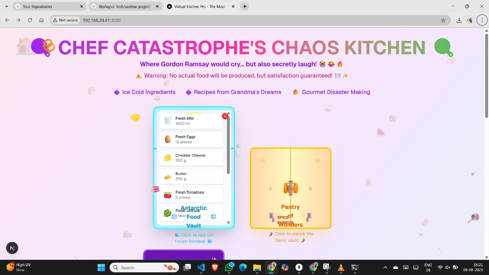
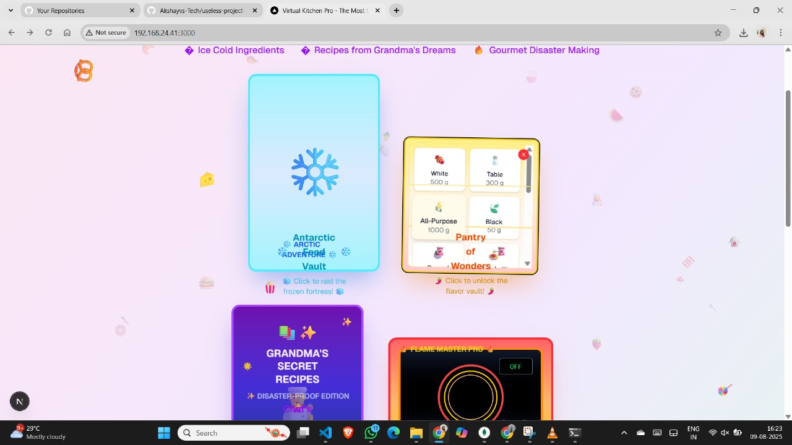
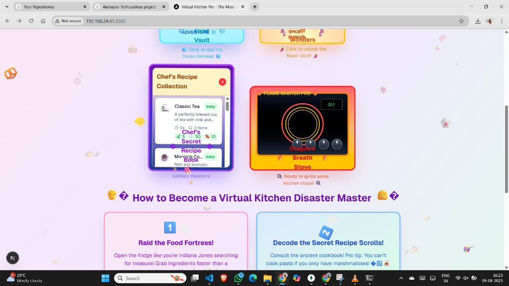

# VIRTUAL KICHEN PRO 🎯


## Basic Details
### Team Name: [Name]


### Team Members
- Team Lead: VEDHA VK - COCHIN UNIVERSITY COLEGE OF ENGINEERING KUTTANDU
- Member 2: AKSHAY VS - COCHIN UNIVERSITY COLEGE OF ENGINEERING KUTTANDU


### Project Description
The most useless but beautifully designed virtual kitchen where you can cook gorgeous virtual food that you'll never be able to eat!

### The Problem (that doesn't exist)
People can already cook in real kitchens… but tragically, they lack a way to waste time making fake meals they can’t eat.

### The Solution (that nobody asked for)
We built a fully interactive virtual kitchen that lets you choose, fry, and plate imaginary food—perfect for anyone who wants all the effort of cooking with none of the edible results.
## Technical Details
### Technologies/Components Used
- **Framework**: Next.js 15 with App Router
- **Language**: TypeScript
- **Styling**: Tailwind CSS
- **Animations**: Framer Motion
- **Icons**: Lucide React
- **State Management**: React Context + useReducer

### Implementation
For Software:
### Installation

1. Clone the repository:

```bash
git clone <repository-url>
cd useless_gokul
```

2. Install dependencies:

```bash
npm install
# or
yarn install
# or
pnpm install
```

3. Run the development server:

```bash
npm run dev
# or
yarn dev
# or
pnpm dev
```

4. Open [http://localhost:3000](http://localhost:3000) in your browser to start cooking!

### Build for Production

```bash
npm run build
npm start
```
### Project Documentation
For Software:

# Screenshots







### Project Demo
# Video
[ **demo video** ](https://github.com/user-attachments/assets/9360b42e-3156-4157-8a9e-d85f7ff5e6c7)
*Explain what the video demonstrates*

# Additional Demos
[Add any extra demo materials/links]

## Team Contributions
- [Name 1]: [Specific contributions]
- [Name 2]: [Specific contributions]
- [Name 3]: [Specific contributions]

---
Made with ❤️ at TinkerHub Useless Projects 


